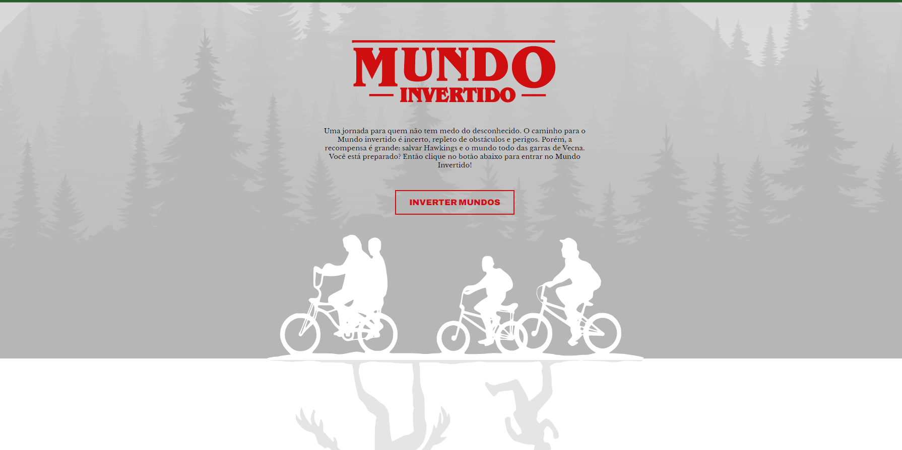
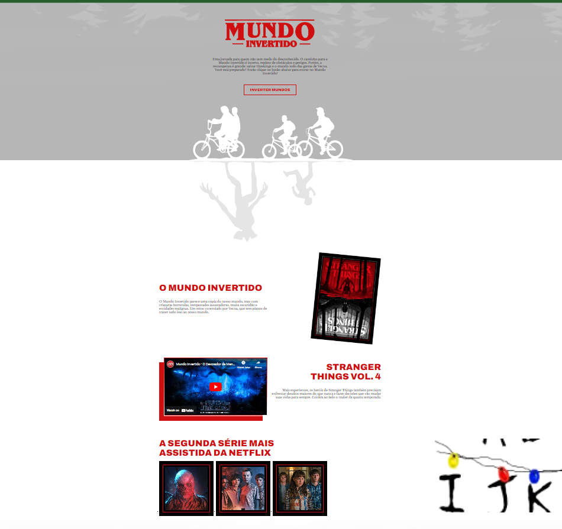

# Projeto Mundo Invertido

<!-- Inserir imagem com a #vitrinedev ao final do link -->

  <a href="#-tecnologias">Tecnologias</a>&nbsp;&nbsp;&nbsp;|&nbsp;&nbsp;&nbsp;  
  <a href="#-projeto">Projeto</a>&nbsp;&nbsp;&nbsp;|&nbsp;&nbsp;&nbsp;  
  <a href="#-Imagem">Imagem</a>&nbsp;&nbsp;&nbsp;&nbsp;&nbsp;&nbsp;

 

## 🚀 Tecnologias

Esse projeto foi desenvolvido com as seguintes tecnologias:

- HTML
- CSS
- JavaScript
- Git e Github

 

## 💻 Projeto

Projeto desenvolvido com a DIO.me.

 

## 📸 Imagem
Página do Mundo Invertido

</img>

## 📁 Acesso ao projeto

[Veja o projeto final do curso em funcionamento](https://thamyresmya.github.io/MundoInvertido/).

 

- Me siga nas redes sociais:
- [Linkedin](https://www.linkedin.com/in/thamyrescavalcante/)
- [Instagran](https://www.instagram.com/thamyres__cavalcante/)

 

---

Feito com ♥ by Thamyres Cavalcante.

