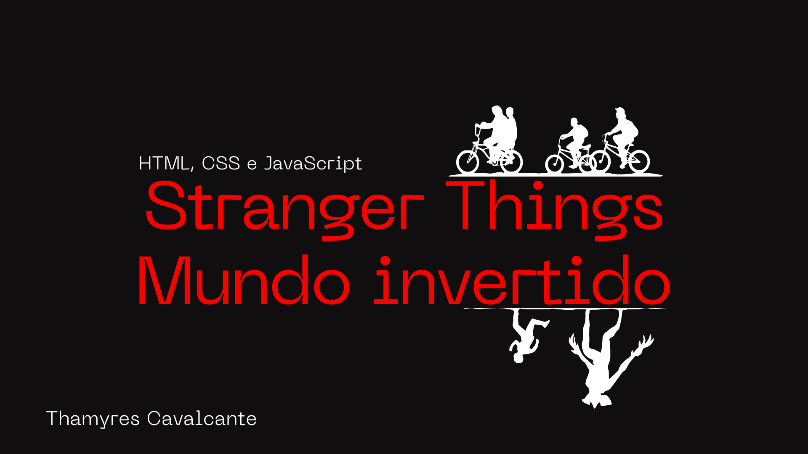
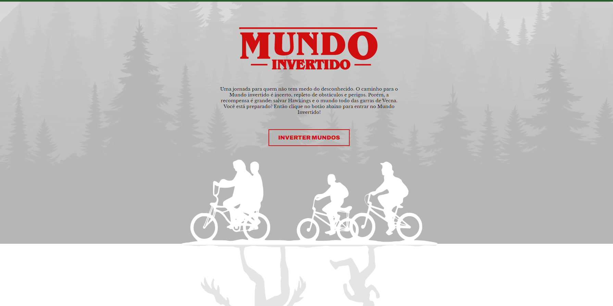

# Projeto Mundo Invertido

  <a href="#-tecnologias">Tecnologias</a>&nbsp;&nbsp;&nbsp;|&nbsp;&nbsp;&nbsp;
   <a href="#-projeto">Projeto</a>&nbsp;&nbsp;&nbsp;|&nbsp;&nbsp;&nbsp;  
  <a href="#-Layout">Funcionalidades</a>&nbsp;&nbsp;&nbsp;|&nbsp;&nbsp;&nbsp; 
  <a href="#-Documentação">Acesso</a>&nbsp;&nbsp;&nbsp;&nbsp;&nbsp;&nbsp;    

 

## 🚀 Tecnologias

Esse projeto foi desenvolvido com as seguintes tecnologias:

- HTML
- CSS
- JavaScript
- Git e Github

 

## 💻 Projeto

Projeto de uma página com o tema mundo invertido da série Stranger Things. Projeto desenvolvido junto com a DIO.me.

 

## 🔨 Funcionalidades do projeto

O projeto tem um carrossel de filmes, botões de assistir agora e mais informações. 

Abaixo segue um exemplo:

</img>

Imagem da página da aplicação 
</img>

 

## 📁 Acesso ao projeto

É possível baixar ou acessar o código fonte do projeto através desse [Link.](https://github.com/Thamyresmya/MundoInvertido)

 

## 🛠️ Abrir e rodar o projeto

Para acessar a página basta clicar nesse [Link](https://thamyresmya.github.io/MundoInvertido/).

 

- Me siga nas redes sociais:
- [Linkedin](https://www.linkedin.com/in/thamyrescavalcante/)
- [Instagran](https://www.instagram.com/thamyres__cavalcante/)

 

---

Feito com ♥ by Thamyres Cavalcante.

